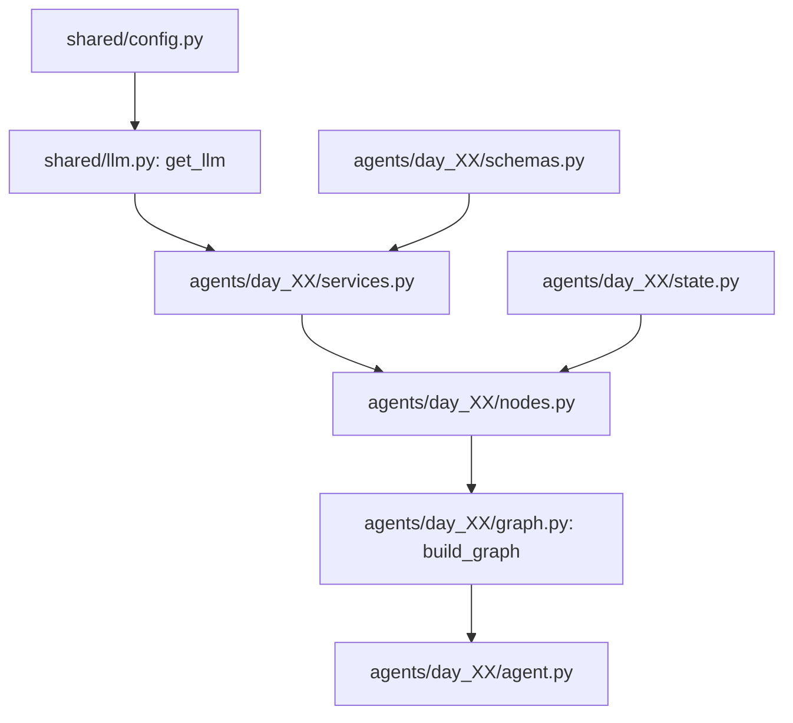

# ⚡ 30 AI Agents in 30 Days: Systems-First Engineering

<p align="center">
  <a href="https://python.org"></a>
  <a href="https://github.com/langchain-ai/langgraph"></a>
  <a href="https://docs.pydantic.dev/"></a>
  <a href="https://fastapi.tiangolo.com/"></a>
  <a href="https://docker.com"></a>
  <a href="https://pytest.org"></a>
  <a href="./ROADMAP.md"></a>
</p>

---

## 💡 About the Project

**30 AI Agents in 30 Days** is a systems-first engineering journey dedicated to building **production-grade, autonomous AI agents**. 

Rather than building simple prompt wrappers or basic chat UIs, every agent in this repository is designed around real-world software engineering requirements: **explicit state machines, type safety, self-healing retries, memory persistence, tool orchestration, security guardrails, and enterprise observability**.

Each day introduces a distinct architectural pattern while reinforcing best practices in modular design and containerized deployment.

---

## 🎯 Engineering Principles

> **Prompting an LLM is easy. Engineering reliable AI systems that survive malformed outputs, API timeouts, tool failures, and production scale is software engineering.**

Every agent project in this repository adheres to five core engineering pillars:

1. **Explicit State Graphs:** Deterministic execution flow built on [LangGraph](https://github.com/langchain-ai/langgraph) state machines instead of unbounded prompt loops.
2. **Defensive Type Safety:** Strict input/output schema validation using **Pydantic v2** and static type hinting.
3. **Dependency Injection Architecture:** Decoupled LLM factory providers, services, state schemas, and node handlers for maximum testability.
4. **Self-Healing Mechanics:** Automated exception catching, schema reflection, and retry nodes that correct invalid LLM outputs autonomously.
5. **Production Baseline:** Unit testing with `pytest`, containerization via `Docker`, structured logging, latency tracking, and LangSmith tracing on every single build.

---

## 🏗️ Repository Folder Structure

The workspace follows a strict, modular layout separating shared infrastructure, daily agent code, documentation, and shared templates:

```text
30-days-30-ai-agents/
│
├── .github/                  # CI/CD workflows, GitHub Actions, and automation templates
│   └── workflows/            # Automated linting, static analysis, and test suites
│
├── agents/                   # Daily AI Agent Projects (30 Days)
│   ├── __init__.py
│   ├── day_01_structured_output/
│   │   ├── agent.py          # Daily entrypoint & CLI driver
│   │   ├── graph.py          # LangGraph state workflow compilation
│   │   ├── nodes.py          # Pure execution node handlers
│   │   ├── services.py       # Injected LLM & business logic services
│   │   ├── state.py          # Agent TypedDict state definition
│   │   ├── schemas.py        # Input & Output Pydantic schemas
│   │   ├── exceptions.py     # Agent-specific custom exception definitions
│   │   ├── prompts.py        # Versioned system & user prompt templates
│   │   ├── ui.py             # Rich terminal rendering interface
│   │   ├── Dockerfile        # Agent containerization manifest
│   │   ├── README.md         # Daily agent technical documentation
│   │   └── tests/            # Daily agent unit & integration tests
│   │       └── test_agent.py
│   └── day_02_.../           # Upcoming daily agent modules
│
├── shared/                   # Enterprise Shared Infrastructure Layer
│   ├── config.py             # Centralized environment & model settings
│   ├── llm.py                # Provider-agnostic LLM Factory (Groq, OpenAI, Anthropic, Gemini)
│   ├── logger.py             # Rich structured console & file logging
│   ├── utils.py              # Execution tracking, timing & latency benchmark utilities
│   ├── guardrails.py         # Global input/output security & schema validators
│   ├── caching/              # Shared cache providers (Redis, memory)
│   ├── evaluation/           # RAG & benchmark evaluation scripts
│   ├── memory/               # Persistent memory checkpointers (SQLite, Redis)
│   ├── observability/        # LangSmith & OpenTelemetry tracing handlers
│   ├── prompts/              # Shared prompt templates & meta-prompts
│   └── services/             # Shared external API wrappers & tooling
│
├── assets/                   # Terminal recordings, screenshots, and visual architecture diagrams
├── docs/                     # In-depth architectural design docs & RFCs
├── templates/                # Daily boilerplate starter kit for standardized agent creation
├── .env.example              # Template for required environment variables
├── docker-compose.yml        # Infrastructure orchestrator (Redis, ChromaDB, PostgreSQL)
├── pyrightconfig.json        # Static type-checking configuration
├── requirements.txt          # Python dependencies & pinnings
├── README.md                 # Project Overview & Architecture Guide (This File)
└── ROADMAP.md                # 30-Day Master Curriculum & Learning Progression
```

---

## 🧩 Architecture & Dependency Injection (DI)

To guarantee modularity, maintainability, and testability, this repository implements a strict **Dependency Injection (DI)** design pattern across all agents and services.



### Key Components of the Dependency Injection Layer

#### 1. Provider-Agnostic LLM Factory (`shared/llm.py`)
Rather than instantiating LLM clients directly inside agent nodes, all model instances are constructed dynamically via the `get_llm()` factory:
```python
# shared/llm.py
def get_llm(provider: str = MODEL_PROVIDER, model: str = MODEL_NAME, temperature: float = TEMPERATURE, **kwargs) -> BaseChatModel:
    ...
```
Supported providers include **Groq** (`llama-3.3-70b-versatile`), **OpenAI** (`gpt-4o-mini`), **Anthropic** (`claude-3-5-sonnet`), and **Google Gemini** (`gemini-1.5-flash`). Changing the model provider globally requires only a single environment variable change in `.env`.

#### 2. Service Layer Injections (`agents/day_XX/services.py`)
Agent-specific services encapsulate model bindings and output parsing configurations. Schema dependencies are injected into the LLM instance using LangChain's `.with_structured_output()` mechanism:
```python
# agents/day_01_structured_output/services.py
def get_structured_llm():
    llm = get_llm(provider=MODEL_PROVIDER, model=MODEL_NAME, temperature=TEMPERATURE)
    return llm.with_structured_output(CandidateProfile, include_raw=False)
```

#### 3. Decoupled Node Handlers (`agents/day_XX/nodes.py`)
Nodes act as pure state transition functions in the graph. They receive the agent state (`TypedDict`), interact with injected service providers, and return state mutations:
```python
# agents/day_01_structured_output/nodes.py
def extract_node(state: ExtractorState) -> Dict[str, Any]:
    llm = get_structured_llm()
    # Execute LLM call cleanly without hardcoded provider logic
    ...
```

#### 4. Isolated Testability & Mocking
Because LLM clients, state schemas, and node handlers are loosely coupled:
- **Unit Testing:** Nodes and custom guardrails can be unit-tested with mock LLM responses using `pytest` without invoking live API calls.
- **Provider Switching:** Swap models or fallback providers dynamically during runtime retries without altering graph topology.

---

## ⚙️ Tech Stack

| Category | Technologies / Libraries |
| :--- | :--- |
| **Language** | Python 3.11+ |
| **Orchestration** | LangGraph, LangChain |
| **Data Validation** | Pydantic v2, Python `typing` |
| **LLM Providers** | Groq (Llama 3.3), OpenAI (GPT-4o), Anthropic (Claude 3.5), Google (Gemini 1.5) |
| **API & Web** | FastAPI, Uvicorn, Requests |
| **Databases & Vectors** | ChromaDB, Redis, SQLite, PostgreSQL / pgvector |
| **Automation & Tools** | Playwright, NetworkX, Matplotlib, PyMuPDF, Whisper |
| **Testing & Observability** | pytest, LangSmith, RAGAS, Rich |
| **Infrastructure** | Docker, Docker Compose, GitHub Actions |

---

## 🚀 Quick Start Guide

### 1. Prerequisites
- **Python 3.11+** installed
- **Git** installed
- **Docker Desktop** (optional, for containerized infrastructure and agent execution)

### 2. Clone the Repository
```bash
git clone https://github.com/tamanna-singh02/30-days-30-ai-agents.git
cd 30-days-30-ai-agents
```

### 3. Create & Activate Virtual Environment
```bash
# Create virtual environment
python -m venv venv

# Activate on Windows (PowerShell)
.\venv\Scripts\Activate.ps1

# Activate on Linux/macOS
source venv/bin/activate
```

### 4. Install Dependencies
```bash
pip install -r requirements.txt
```

### 5. Configure Environment Variables
Copy `.env.example` to `.env` and fill in your API credentials:
```bash
cp .env.example .env
```
Key environment variables:
```env
MODEL_PROVIDER=groq
MODEL_NAME=llama-3.3-70b-versatile
GROQ_API_KEY=your_groq_api_key_here
OPENAI_API_KEY=your_openai_api_key_here
LANGCHAIN_TRACING_V2=true
LANGCHAIN_API_KEY=your_langsmith_api_key_here
```

### 6. Run Infrastructure Services (Optional)
Start backing services (Redis, ChromaDB, Postgres):
```bash
docker compose up -d
```

### 7. Execute Day 01 Agent
Run the structured output extraction agent from the repository root:
```bash
python -m agents.day_01_structured_output.agent
```

### 8. Run Unit Tests
Execute the full test suite with `pytest`:
```bash
pytest
```

---

## 📚 30-Day Learning Curriculum

The complete 30-day curriculum matrix, daily tech stack, and weekly themes are maintained in [ROADMAP.md](ROADMAP.md).

- 🗓️ **Week 1: Foundations, Schemas & Memory Persistence** (Days 01–07)
- 🗓️ **Week 2: External Tools, SQL & Web Automation** (Days 08–14)
- 🗓️ **Week 3: Multimodal Perception, Reasoning & Policy Rails** (Days 15–21)
- 🗓️ **Week 4: Multi-Agent Systems & Enterprise Scaling** (Days 22–30)

➡️ **[View Detailed 30-Day Curriculum Roadmap →](ROADMAP.md)**

---

## 🤝 Contributing

Contributions, issues, and feature requests are welcome!

1. Fork the project repository.
2. Create your feature branch (`git checkout -b feature/AmazingAgent`).
3. Ensure all tests pass (`pytest`) and type checks conform (`pyright`).
4. Commit your changes (`git commit -m 'Add basic agent node'`).
5. Push to the branch (`git push origin feature/AmazingAgent`).
6. Open a Pull Request.

---

## 📜 License

Distributed under the **MIT License**. See `LICENSE` for more information.
